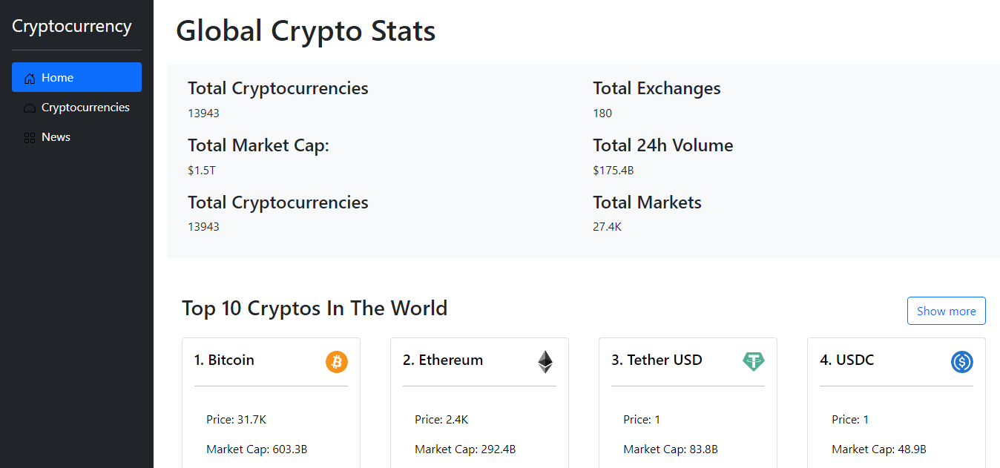

# Cryptocurrency

> Cryptocurrency app for displaying data about cryptocurrencies real time data with charts and all types.

## Built With

- React
- Redux Toolkit
- RTK Query
- [RapidApis](https://rapidapi.com/): [Coinranking](https://rapidapi.com/Coinranking/api/coinranking1/) & [Bing News Search](https://rapidapi.com/microsoft-azure-org-microsoft-cognitive-services/api/bing-news-search1/)

## Live Demo

[Live Demo Link](https://cryptoapicurrency.netlify.app)

## Getting Started
To get a local copy up and running follow these simple example steps.

- Click on the top right green "code" button.
- On the dropdown menu, choose "download with zip" button.
- After download, extract the zip file and you have the project on your machine.
- After downloading run `npm i` to install all Node packages.
- Run `npm start` to run the project.

### Required Install

- Node
- npm

## Author

👤 **Kerolous Samy**

- GitHub: [@keroloussamy](https://github.com/keroloussamy)
- Twitter: [@keroloussamy](https://twitter.com/kerolous_samy)
- LinkedIn: [keroloussamy](https://www.linkedin.com/in/keroloussamy/)

## 🤝 Contributing

Contributions, issues, and feature requests are welcome!

Feel free to check the [issues page](../../issues/).

## Show your support

Give a ⭐️ if you like this project!

## Acknowledgments
- Original idea by [Adrian Hajdin - JavaScript Mastery](https://github.com/adrianhajdin/project_cryptoverse).

## 📝 License

This project is [MIT](./MIT.md) licensed.
